
<h1 align="center">智慧草莓基地管理系统</h1>

## 简介
智慧草莓基地管理系统：系统角色包括管理员和普通用户，实现草莓种植信息管理、环境监控、病虫害防控、订单处理及用户账户管理功能，通过实时数据分析提高种植效率和质量。    --计算机毕业设计源码；毕设源码；java毕业设计源码

## 联系方式

<h3 align="center">获取完整代码与数据库文件 + 微信：deepguan QQ: 86050149 QQ群: 783742310</h3>

<h3 align="center">可帮忙远程部署 包运行成功！提供远程部署、修改代码、设计文档指导、代码讲解等服务！</h3>

## 功能介绍（完整见运行截图）
管理员： 基本功能包括登录、注册、和退出操作。能够管理网站首页的信息，通过主导航栏访问个人中心、草莓类型管理、及温湿度监控管理等模块。管理草莓种植计划类型，并可查看和编辑订单详情。支持在后台系统中进行用户管理、轮播图信息管理，以及草莓基地的病虫害预警和湿度监控管理。能够发布公告信息和管理草莓收藏。

用户： 提供基本功能如登录和注册。用户注册界面简洁，允许输入个人信息如用户名、密码、和联系方式。用户可以通过系统查看草莓生长的实时环境数据，管理种植计划，提高草莓种植的效率和质量。个人中心提供用户信息管理如更新个人资料及订单查询，支持收货地址的添加和管理。在购物模块中实现草莓产品的浏览、搜索、添加到购物车和购买功能，并能够发表评论，参与系统互动。

## 运行截图
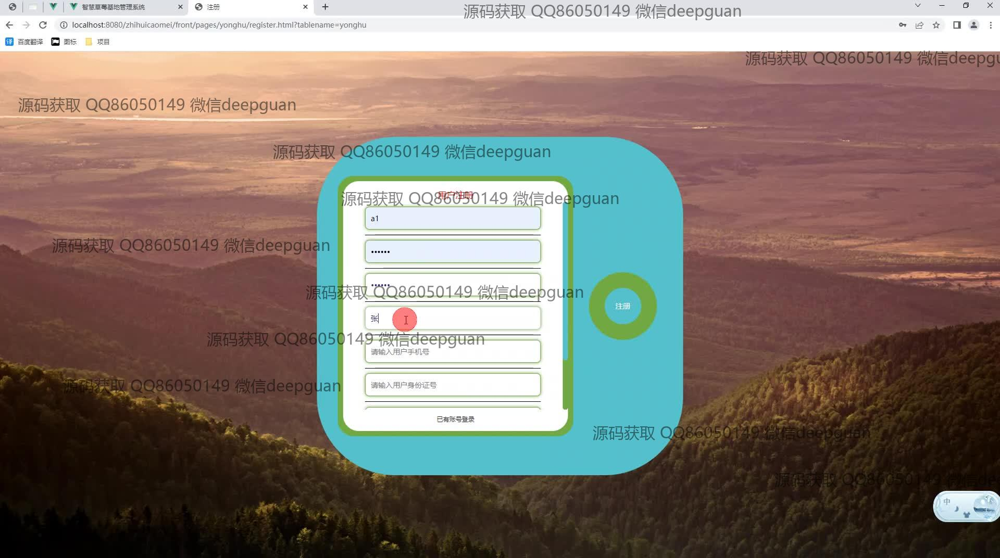
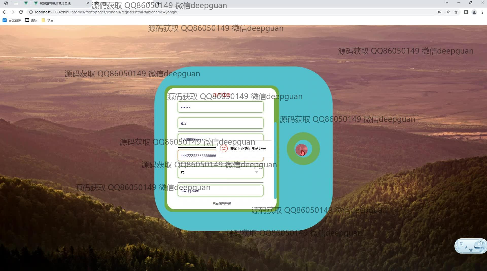
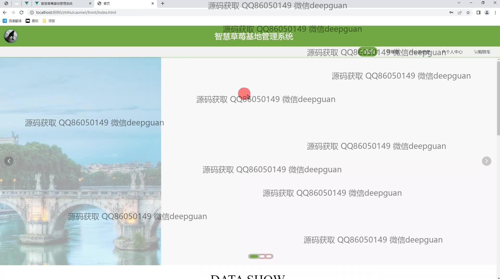
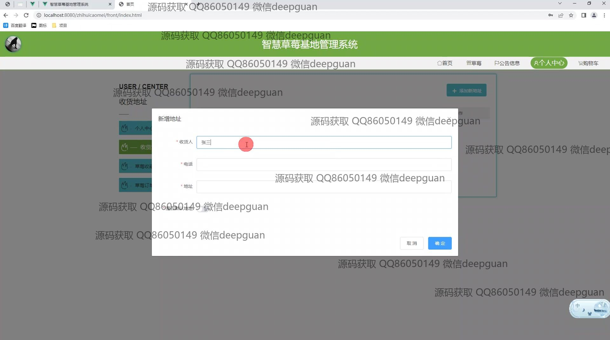
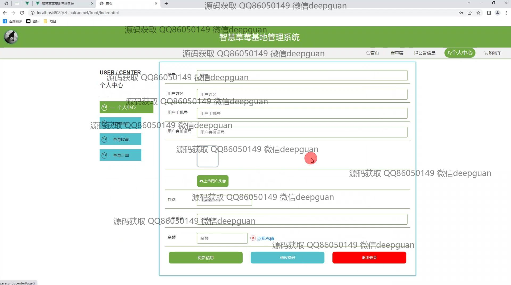
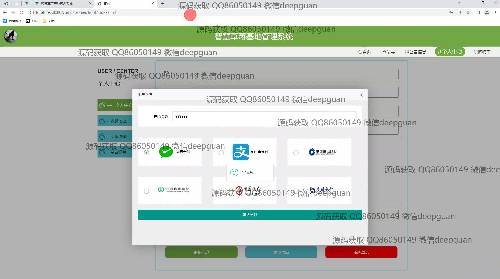
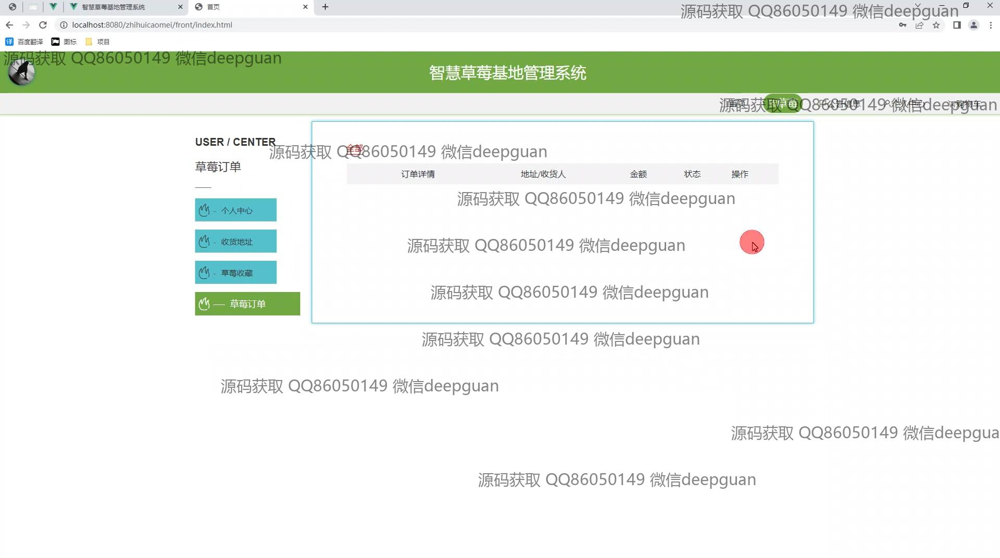
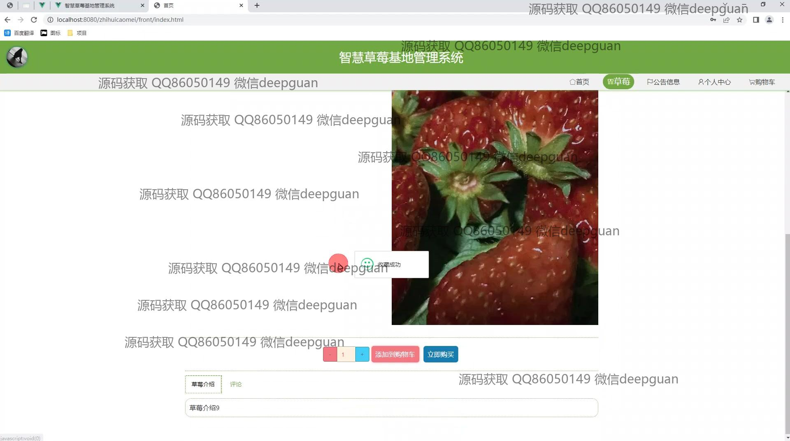
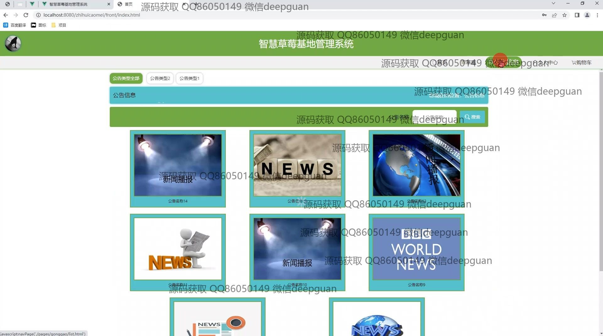
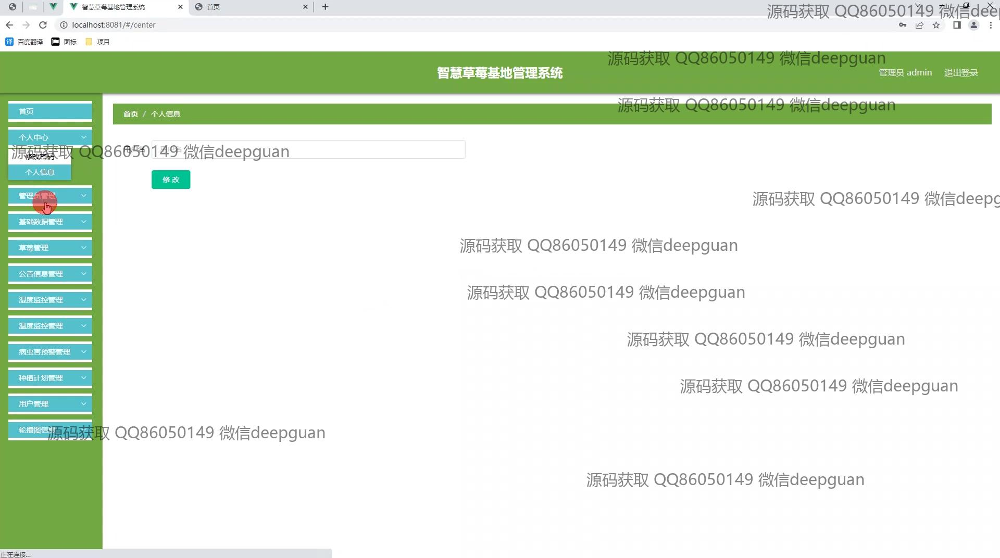
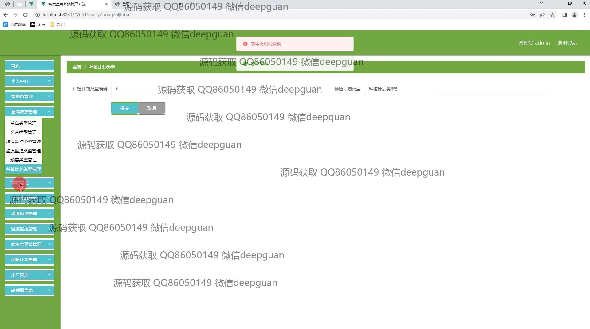
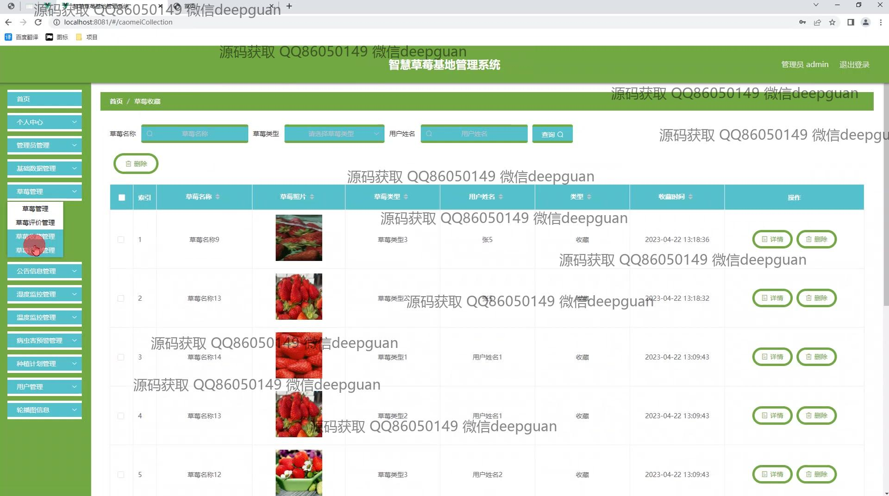
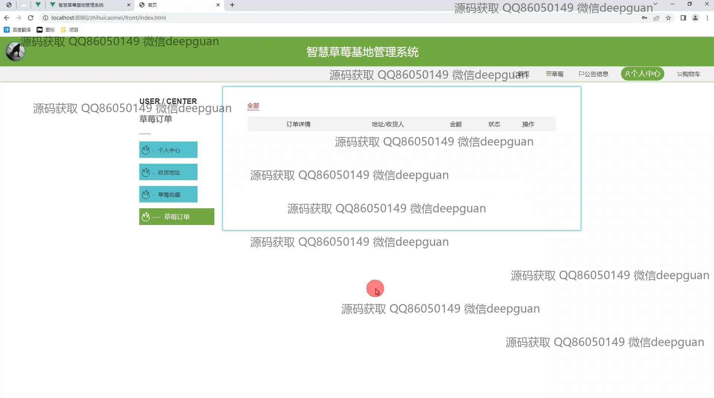
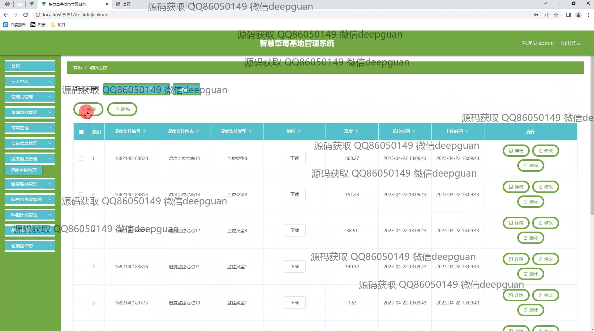
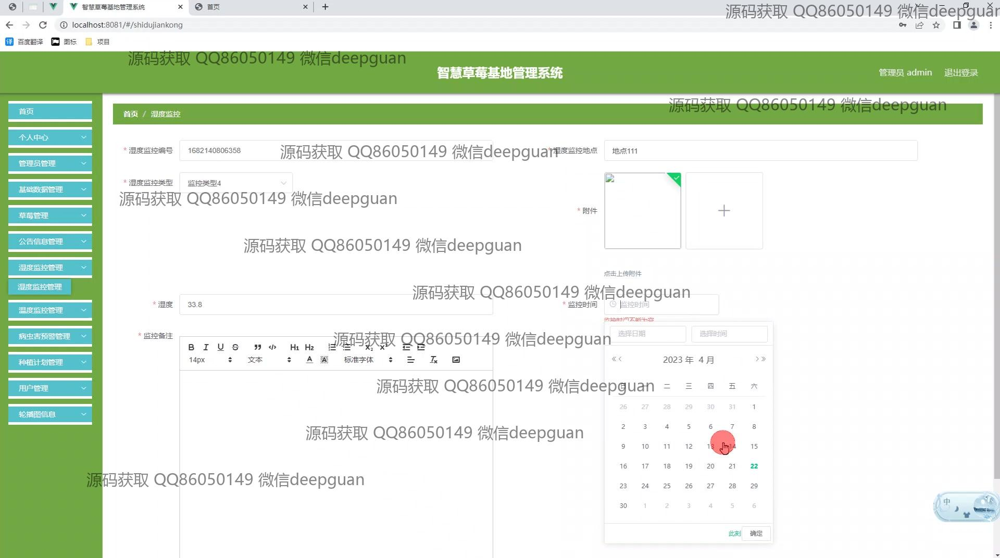
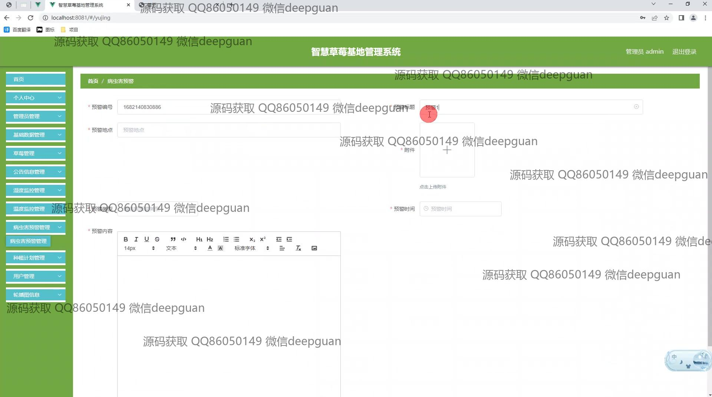
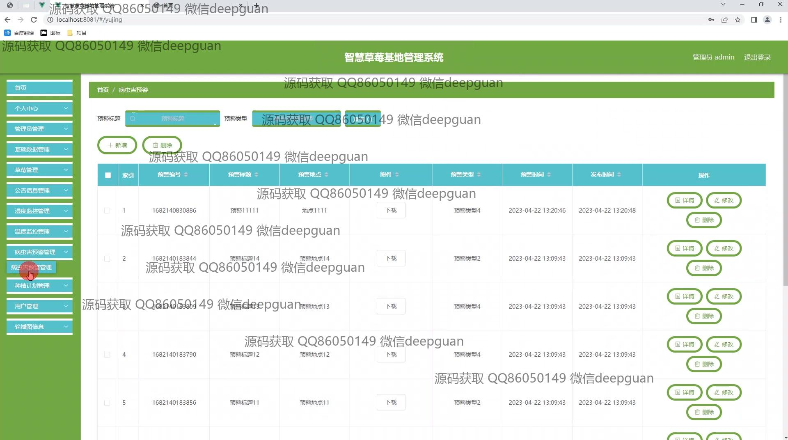
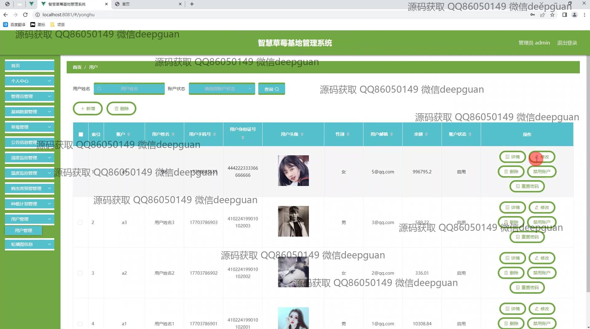
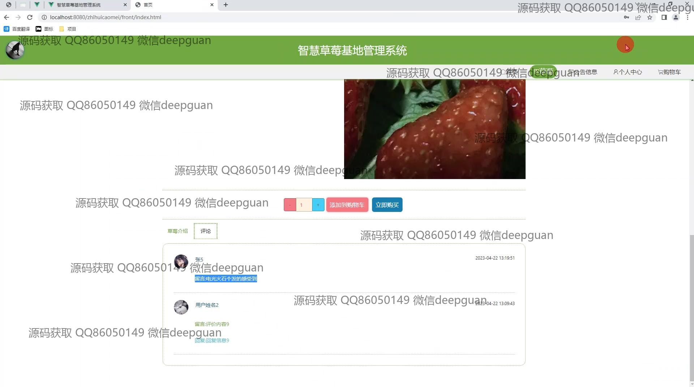

本代码来源于网络,仅供学习参考使用!

